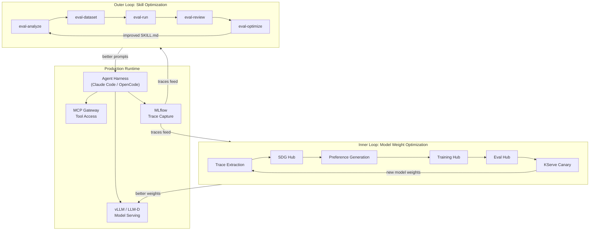

# Architecture Overview: Agentic Continual Learning

## TL;DR

The Agentic Continual Learning architecture is a unified system that improves AI agents autonomously from their own production experience. It consists of **two nested optimization loops** connected by **MLflow as the shared data plane**:

- **Outer Loop (Token-Space)**: Optimizes *what the agent is told* -- skill instructions, prompts, tool configurations -- using the agent-eval-harness. Runs continuously. Output: improved `SKILL.md` files.
- **Inner Loop (Weight-Space)**: Optimizes *how the model performs* -- fine-tuning model weights from production traces via SFT/DPO/GRPO -- using Training Hub. Runs periodically (daily/weekly). Output: improved model checkpoints.

The target outcome is a **progressive compression pipeline**: start with a frontier LLM (e.g., Claude Opus), distill production traces into a tuned open-source model (e.g., Llama 70B), then further compress to a Small Language Model (e.g., Granite 8B) -- each stage maintaining task performance while reducing inference costs 10-30x.

No open-source equivalent of OpenAI's Stored Completions + Distillation pipeline exists for self-hosted models. This architecture fills that gap.

---

## Two-Loop Design



**Key design principle**: The two loops are complementary but independent. The outer loop runs fast (minutes per iteration) and optimizes prompts. The inner loop runs slow (hours/days per iteration) and optimizes weights. Both read from the same MLflow trace store, but they produce different artifacts (SKILL.md vs model checkpoints).

---

## Component Integration Map

| Component | Role | Integration Points |
|-----------|------|--------------------|
| **MLflow** | Trace capture, experiment tracking, annotations, model registry | All components read/write MLflow |
| **Eval Hub** | Evaluation orchestration (skills + models + safety) | Agent eval harness provider, lm-evaluation-harness, Garak, GuideLLM |
| **SDG Hub** | Synthetic data generation for training data expansion | Reads MLflow traces, produces JSONL datasets for Training Hub |
| **Training Hub** | Model fine-tuning (SFT, OSFT, DPO, GRPO) via Kubeflow Trainer v2 | Consumes datasets from SDG Hub/MLflow, publishes to model registry |
| **Agent Eval Harness** | Skill evaluation and optimization (outer loop) | Eval Hub provider, MLflow experiment logging |
| **Kagenti** | Agent lifecycle management on OpenShift AI | AgentCard CRDs, identity injection, governance |
| **vLLM / LLM-D** | Model inference serving | OpenAI-compatible API, KV cache routing |
| **KServe** | Model serving with traffic splitting | Canary deployments for model transitions |

---

## Progressive Compression Pipeline

```
Stage 1: Frontier LLM (e.g., Claude Opus / Nemotron)
  │  Production traces captured via MLflow
  │  Agent skills optimized via outer loop
  ▼
Stage 2: Tuned Open Model (e.g., Llama 70B fine-tuned)
  │  SFT on production traces + DPO on preference pairs
  │  Canary deployment with traffic splitting
  │  Eval Hub: benchmark comparison against frontier baseline
  ▼
Stage 3: Distilled SLM (e.g., Granite 8B)
  │  Knowledge distillation from tuned model
  │  LoRA GRPO refinement on structured agent trajectories
  │  Final evaluation against both baselines
  ▼
Production Deployment
  Cost reduction: 10-30x per stage (NVIDIA SLM research)
  Performance: maintained via eval-gated progression
```

Each stage transition is **eval-gated**: the candidate model must match or exceed the current model's performance on the agent skill evaluation suite before traffic is shifted.

---

## Comparison to OpenAI's Proprietary Pipeline

| Capability | OpenAI (Proprietary) | This Architecture (Open-Source) |
|------------|---------------------|---------------------------------|
| Trace capture | Stored Completions API | MLflow auto-tracing |
| Distillation | Distillation API (GPT-4o → GPT-4o-mini) | Training Hub (SFT/DPO/GRPO) |
| Evaluation | Evals framework | Eval Hub + agent-eval-harness |
| Deployment | API model swap | KServe canary + traffic splitting |
| Prompt optimization | Not automated | Outer loop (eval-optimize) |
| Cost | Proprietary, vendor lock-in | Self-hosted on OpenShift AI |

The critical gap this architecture fills: **no end-to-end open-source pipeline from production traces to deployed SLM exists today**.

---

## Design Principles Assessment

1. **Two nested loops, one observability layer** -- Sound. MLflow as single source of truth prevents data drift between loops.
2. **Evaluate everything uniformly** -- Sound. Eval Hub as single orchestration point avoids evaluation fragmentation.
3. **Progressive compression** -- Ambitious but validated by NVIDIA research and OpenAI's distillation results.
4. **Production-driven, not synthetic-only** -- Critical differentiator. Real traces reflect actual usage patterns.
5. **Platform-native** -- Practical. All components run on OpenShift AI, reducing operational complexity.

**Principal engineer concern**: Loop interference (see [06-risks-and-gaps.md](06-risks-and-gaps.md) for detailed analysis).
