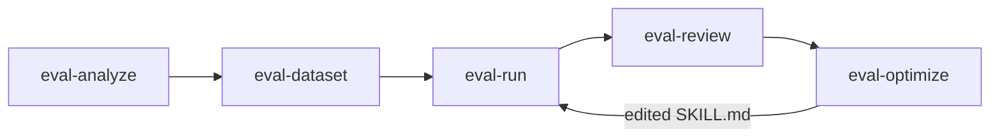

# Outer Loop Analysis: Agent Skill Optimization

## What is the Outer Loop?

The outer loop optimizes **what the agent is told to do** -- instructions, prompts, tool configurations stored in `SKILL.md` files -- without changing the underlying model weights. It operates in "token space" (modifying context the model receives) and runs using the **agent-eval-harness** framework.

The optimization target is always `SKILL.md`, never the model, eval config, or test cases.

---

## Pipeline Steps



### 1. eval-analyze
Examines a target skill's `SKILL.md`, discovers test cases, and generates `eval.yaml` with:
- Natural language `schema` descriptions of dataset and outputs
- Suggested judges (inline checks + LLM quality assessment)
- Regression thresholds

### 2. eval-dataset
Generates test cases based on skill analysis. Creates `input.yaml` files with prompts, optional reference outputs, and annotations.

### 3. eval-run (core execution)
The most complex step. Orchestrated by `skills/eval-run/scripts/`:

| Sub-step | Script | Action |
|----------|--------|--------|
| Config discovery | `discover.py` | Find and load `eval.yaml` |
| Preflight | `preflight.py` | Check for stale artifacts |
| Workspace setup | `workspace.py` | Create isolated workspace per case, set up tool interception hooks |
| Execution | `execute.py` | Invoke the runner (`EvalRunner.run_skill()`) |
| Collection | `collect.py` | Parse stdout into `events.json`, gather artifacts |
| Scoring | `score.py` | Run judges, compute pass rates and means |
| Reporting | `report.py` | Generate analysis and HTML report |

### 4. eval-review
Human-in-the-loop review. Presents judge scores and outputs for qualitative feedback. Produces `review.yaml` with per-case assessments.

### 5. eval-optimize
The **closed loop** step. Reads judge failures and rationales, performs root cause analysis, then makes **surgical edits to SKILL.md only**. Re-runs eval-run with `--baseline` to check for regressions. Iterates up to `max-iterations` (default 3).

Hard constraints:
- Does NOT modify test cases, judges, or `eval.yaml`
- Does NOT edit builtin judge code
- Only edits `SKILL.md` (the skill instructions/prompt)

---

## Runner Abstraction

The harness is agent-agnostic via `EvalRunner` ABC (`agent_eval/agent/base.py`):

| Runner | `runner.type` | Mechanism | Events Support |
|--------|--------------|-----------|----------------|
| **ClaudeCodeRunner** | `claude-code` | `claude --print --model {model} --output-format stream-json` | Full (stream-json JSONL) |
| **CliRunner** | `cli` | Arbitrary command template with `{placeholder}` substitution | Only if stdout is Claude-compatible JSONL |
| **ResponsesAPIRunner** | `responses-api` | OpenAI Responses API + Shell tool | Partial |

### CLI Runner for OpenCode

The `cli` runner (`agent_eval/agent/cli_runner.py`) is the path for running eval-harness with OpenCode or any non-Claude agent. It supports placeholder substitution:

```yaml
runner:
  type: cli
  command: "opencode run {agent} --workspace {workspace} --model {model}"
```

Available placeholders: `{agent}`, `{workspace}`, `{output_dir}`, `{model}`, `{subagent_model}`, `{timeout}`, `{max_budget_usd}`, `{effort}`, `{system_prompt}`, `{args}`, plus any field from `input.yaml`.

**Limitations vs Claude Code runner**:
- No tool interception (AskUserQuestion hooks, MCP blocking)
- No structured events unless stdout is Claude-compatible JSONL
- Budget enforcement is advisory only
- No permission denial detection
- No subagent transcript capture

---

## Judge System

Judges are the **reward signal** of the outer loop. They grade agent output and their scores drive eval-optimize decisions.

### Judge Types

| Type | Config | Mechanism |
|------|--------|-----------|
| **Builtin** | `builtin: "cost_budget"` | Auto-discovered from `agent_eval/judges/` |
| **Inline check** | `check: "python snippet"` | Deterministic Python returning `(bool, str)` |
| **LLM** | `prompt:` or `prompt_file:` | Jinja2 template → Anthropic API → parsed score |
| **External code** | `module:`, `function:` | `importlib` loaded Python function |

### The `outputs` Dict (What Judges See)

Judges receive a rich record per case:

| Key | Content |
|-----|---------|
| `files` | All collected artifacts as `{path: content}` |
| `events` | Parsed structured events from `events.json` |
| `conversation` | Root assistant text extracted from events |
| `tool_calls` | Tool call sequence from events |
| `exit_code`, `duration_s`, `cost_usd`, `num_turns` | Execution metrics |
| `annotations` | Ground truth from dataset `annotations.yaml` |

### Judge Scores as DPO Signal

The judge system produces signals that map naturally to DPO preference pairs:

| Signal | Mechanism | DPO Mapping |
|--------|-----------|-------------|
| **Pairwise comparison** | `compare_runs()` with position-debiased LLM judge | Direct: winner = chosen, loser = rejected |
| **Bool judges** | pass/fail + rationale | Binary reward for filtering |
| **Numeric LLM judges** | 1-5 scores | Continuous reward signal |
| **Per-case artifacts** | Full trajectories in `events` + `files` | Training data (input + trajectory) |

This is the **bridge** between the outer loop and inner loop: judge scores from skill evaluations can serve as reward/preference signal for model training.

---

## Eval-Gated Progression

Regression detection in `score.py detect_regressions()`:

| Threshold | Applies to | Failure condition |
|-----------|-----------|-------------------|
| `min_pass_rate` | Bool judges | Pass rate below threshold |
| `min_mean` | Numeric judges | Mean score below threshold |
| `min_win_rate` | Pairwise judges | Win rate below threshold |
| Baseline comparison | All | Mean/pass_rate drop > 0.5 vs baseline |

This same mechanism gates the progressive compression pipeline: a compressed model must pass the same eval suite as its predecessor.

---

## Coupling with Inner Loop

**Critical concern**: If the outer loop optimizes a skill for Model A (e.g., Qwen 27B), and the inner loop then replaces Model A with fine-tuned Model A' (or a distilled Model B), the optimized skill may no longer be optimal.

Mitigations:
1. Re-run eval-run after every model swap (detect regressions)
2. Schedule outer loop after inner loop converges (sequential, not concurrent)
3. Design skills to be model-agnostic where possible (avoid model-specific prompt tricks)

This coupling is the most significant architectural risk. See [06-risks-and-gaps.md](06-risks-and-gaps.md).
