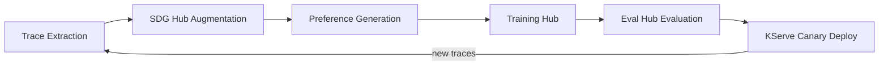

# Inner Loop Analysis: Model Weight Optimization

## What is the Inner Loop?

The inner loop optimizes **how the model performs** by updating its weights based on production experience. It operates in "weight space" and runs periodically (daily/weekly) using **Training Hub** (Kubeflow Trainer v2), **SDG Hub** for data augmentation, and **Eval Hub** for evaluation gating.

The output is improved model checkpoints deployed via KServe canary.

---

## Pipeline Steps



### 1. Trace Extraction
MLflow production traces are exported as training-ready datasets:
- `mlflow.search_traces()` API with SQL-like DSL for filtering
- `trace.to_json()` / `trace.to_dict()` for serialization
- Traces contain spans (agent, tool calls, LLM calls), inputs/outputs, token usage, cost
- Annotations and feedback (human or automated) attached as assessments

### 2. SDG Hub Augmentation
Synthetic Data Generation Hub augments organic traces with:
- Agent trajectory generation from diverse scenarios
- MCP Server Distillation (tool-use specific data)
- Failure case injection (agents need negative examples)
- Multi-teacher diversity (multiple models generating trajectories)

### 3. Preference Generation
Annotated traces produce preference pairs for DPO training:
- **From eval-harness judges**: Pairwise comparison (winner/loser), bool pass/fail, numeric scores
- **From MLflow annotations**: Human feedback via UI, automated judge assessments
- **From trace quality signals**: Successful completions vs failures, cost-efficient vs expensive runs

### 4. Training Hub Execution
Kubeflow Trainer v2 (`TrainJob` CRD) executes training:
- Platform admins define `ClusterTrainingRuntime` templates
- Practitioners create `TrainJob` referencing the runtime via `runtimeRef`
- Supports distributed training via PyTorch FSDP, DeepSpeed

### 5. Eval Hub Evaluation
Comprehensive evaluation before deployment:
- Agent skill tests (via agent-eval-harness provider)
- Model benchmarks (via lm-evaluation-harness)
- Safety scans (via Garak)
- Performance profiling (via GuideLLM)

### 6. KServe Canary Deployment
Gradual rollout with traffic splitting:
- e.g., 10% traffic to candidate, 90% to incumbent
- Monitor eval scores during canary period
- Full cutover only after eval gates pass

---

## Training Methods Comparison

### SFT (Supervised Fine-Tuning)
- **What**: Train on (input, output) pairs. The model learns to replicate demonstrated behavior.
- **When to use**: Initial adaptation to task domain, bootstrapping from production traces.
- **Data**: Clean, high-quality traces of successful agent completions.
- **Limitations**: Doesn't teach the model what NOT to do. Can overfit to surface patterns without learning reasoning.
- **Agent-specific**: Works well for tool-calling format compliance. Poor at teaching multi-step reasoning.

### OSFT (Orthogonal Subspace Fine-Tuning)
- **What**: Fine-tuning that preserves the original model's capabilities by constraining updates to orthogonal subspaces.
- **When to use**: Continual learning scenarios where catastrophic forgetting is a concern.
- **Advantage**: Does not require a supplementary dataset to maintain original distribution.
- **Supported by**: Kubeflow Trainer v2 on Red Hat OpenShift AI (built-in ClusterTrainingRuntime).

### DPO (Direct Preference Optimization)
- **What**: Train on preference pairs (chosen, rejected) without a reward model. The model learns to prefer good outputs over bad ones.
- **When to use**: After SFT, to refine behavior based on quality distinctions.
- **Data**: Pairs of (prompt, good_response, bad_response) with preference labels.
- **Agent-specific**: M-DPO (Multi-Turn DPO, ICLR 2025) extends to multi-turn agent conversations, addressing the credit assignment problem across turns.
- **Bridge to eval-harness**: Pairwise comparison judges (`compare_runs()`) directly produce preference pairs.

### GRPO (Group Relative Policy Optimization)
- **What**: RL algorithm that eliminates the need for a separate critic model. Generates multiple responses per prompt, computes advantages relative to group mean/stddev.
- **Why dominant**: Used to train DeepSeek-R1. Significantly reduces memory (no critic model) and training complexity vs PPO. Works with verifiable rewards (rule-based) and general reward models.
- **Pipeline**: Generate G responses per prompt → score all with reward function → normalize advantages within group → update policy.
- **Agent-specific**: Natural fit for agent tasks with verifiable outcomes (tool calls succeeded, output matches reference, cost within budget).
- **Limitation**: When all responses in a group are homogeneous (all correct or all incorrect), gradient is zero. NGRPO (2025) addresses this with advantage calibration.

### Production Alignment Stack
The emerging consensus for production model training:

```
SFT (task adaptation)
  → DPO/KTO (preference alignment)
    → GRPO/PPO (reinforcement from rewards)
      → Self-Refinement (iterative improvement)
```

For the continual learning architecture:
1. **SFT** on production traces (high-quality completions)
2. **DPO** on preference pairs from judge scores
3. **GRPO** with eval-harness judges as reward functions
4. Re-evaluate and iterate

---

## Progressive Compression

### NVIDIA's SLM Research Findings
- Serving a 7B SLM is **10-30x cheaper** than a 70-175B LLM
- Key claim validated on standard benchmarks, but **agentic workloads are harder** (tool-calling, multi-turn, JSON schema compliance)

### Structured Agent Distillation (SAD)
- Segments trajectories into **REASON** and **ACT** spans
- Applies segment-specific losses (reasoning gets language modeling loss, actions get stricter format loss)
- Outperforms token-level distillation for agent tasks

### Agent-as-Annotators Pattern
- Use a frontier model (Gemini/Claude) as teacher to generate high-quality trajectories
- Filter aggressively (22%+ rejection rate recommended by TOUCAN research)
- Fine-tuned 9B student achieved 41.5% on WebArena (surpassing Claude 3.5 Sonnet at 36%)

### Realistic Cost Reduction for Agentic Workloads
The "10-30x per stage" claim from NVIDIA needs qualification:
- **Tool-calling fidelity degrades fastest** during compression (correct JSON schema, parameter types)
- **Multi-turn credit assignment** is harder in smaller models
- Realistic expectation: 5-15x cost reduction per stage for agentic workloads, with targeted tool-use LoRA to recover fidelity

---

## Training Hub Technical Details

### Kubeflow Trainer v2 Architecture
- **TrainJob CRD**: Single unified abstraction replacing PyTorchJob, MPIJob, etc.
- **ClusterTrainingRuntime / TrainingRuntime**: Infrastructure templates defined by platform admins
- **`runtimeRef`**: TrainJob references a runtime to inherit configuration
- **Built-in runtimes**: `torch-distributed`, `deepspeed-distributed`, `mlx-distributed`
- **Built-in fine-tuning**: SFT and OSFT via ClusterTrainingRuntime templates on RHOAI 3.3+

### Dataset Formats
- Training Hub consumes standard formats: JSONL, Parquet, HuggingFace datasets
- The gap: no standardized agent trajectory format exists across frameworks
- Each framework (LangChain, CrewAI, Claude Code) uses its own trace schema
- MLflow provides a partial solution but needs transformation to training format

### Experiment Tracking
- TrainJob v2.2 supports real-time progress and metrics reporting
- Integration with MLflow via environment variables in the training pod
- Model checkpoints published to MLflow model registry

---

## Key Integration Gap: Judge-to-DPO Bridge

The strategy doc identifies using eval-harness judges as DPO signal. Here's the concrete mapping:

```
eval-harness pairwise comparison
  → compare_runs() with position-debiased LLM judge
  → {winner: "A"|"B"|"tie"} per case
  → DPO training pair: (input, winner_trajectory, loser_trajectory)

eval-harness numeric judge
  → score 1-5 per case
  → Filter: score >= 4 → chosen, score <= 2 → rejected
  → DPO training pair: (input, high_score_trajectory, low_score_trajectory)

eval-harness bool judge
  → pass/fail per case
  → GRPO reward: pass=1.0, fail=0.0
```

This bridge does not exist in code today. Building it is the highest-value integration point for Sprint 2.
