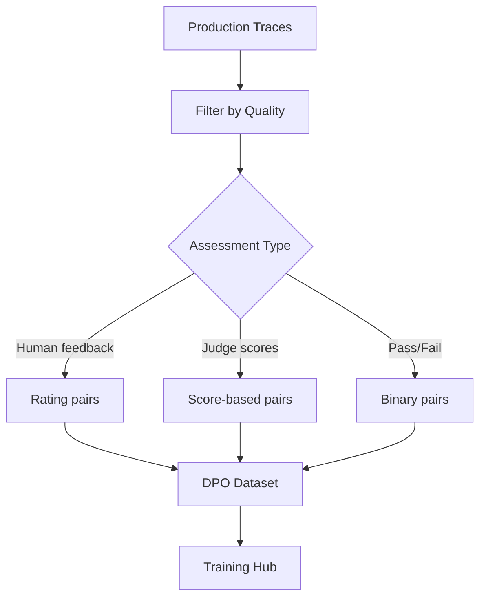

# Bridge Analysis: MLflow as Shared Data Plane

## Role in the Architecture

MLflow is the **critical integration point** between the outer loop (skill optimization) and inner loop (model weight optimization). It serves four roles:

1. **Automated Tracing**: Captures every LLM call, tool invocation, and agent decision in production
2. **Annotations & Feedback**: Human or automated quality labels on traces
3. **Experiment Tracking**: Both loops log evaluation results as MLflow experiments
4. **Model Registry**: Tracks model versions through the compression pipeline

---

## MLflow Tracing for Agents

### What Traces Capture

MLflow traces are hierarchical span trees:

```
Root Span (Agent Invocation)
├── LLM Call Span (model, prompt, response, tokens, cost)
├── Tool Call Span (tool name, input, output)
│   └── Sub-LLM Call Span (if tool triggers another LLM call)
├── LLM Call Span (follow-up reasoning)
└── Tool Call Span (final action)
```

Each span records:
- Inputs and outputs (full content)
- Duration, status (OK/ERROR)
- Metadata (model ID, token counts, cost)
- Parent-child relationships

### Trace Schema (MLflow 3.x)

Key fields available via `mlflow.search_traces()`:

| Field | Type | Description |
|-------|------|-------------|
| `trace_id` | string | Primary identifier |
| `state` | enum | OK, ERROR, IN_PROGRESS |
| `request_time` | int | Start time (ms) |
| `execution_duration` | int | Duration (ms) |
| `inputs` | dict | Root span input |
| `outputs` | dict | Root span output |
| `expectations` | dict | Ground truth labels |
| `assessments` | list | Feedback/annotations |
| `tags` | dict | Custom tags |
| `trace_metadata` | dict | Key-value metadata |

### Export Capabilities

MLflow provides multiple export paths:

```python
# Search and filter traces
traces = mlflow.search_traces(
    filter_string='trace.status = "OK"',
    max_results=1000,
    return_type="list"
)

# Export to dict/JSON for training pipelines
for trace in traces:
    trace_dict = trace.to_dict()  # Full structured dict
    trace_json = trace.to_json()  # JSON string
    
    # Extract training-relevant fields
    root_span = trace.data._get_root_span()
    input_text = root_span.inputs
    output_text = root_span.outputs
```

For bulk operations, the `mlflow-export-import` tool provides CLI utilities (`export-traces`, `export-trace`).

---

## Annotations and Feedback

### Annotation Mechanisms

| Mechanism | Source | Format |
|-----------|--------|--------|
| **MLflow UI annotations** | Human reviewers | Structured feedback via MLflow Monitoring UI |
| **Programmatic assessments** | Automated judges | `mlflow.log_feedback()` with custom metrics |
| **Expectations** | Ground truth | `mlflow.log_expectation()` for pass/fail labels |
| **eval-harness judge scores** | Automated scoring | Logged via `/eval-mlflow` skill |

### Building Evaluation Datasets from Traces

MLflow 3.x directly supports creating evaluation datasets from traces:

```python
# Via UI: Select traces → Actions → Add to evaluation dataset
# Via SDK:
traces = mlflow.search_traces(max_results=100, return_type="list")
annotated_data = []
for trace in traces:
    root_span = trace.data._get_root_span()
    annotated_data.append({
        "inputs": {"text": root_span.inputs["text"]},
        "expectations": {"response": root_span.outputs}
    })
dataset.merge_records(annotated_data)
```

### DPO Preference Generation from Annotations

The path from MLflow traces to DPO training pairs:



---

## Gaps in MLflow's Current Agent Tracing

### Gap 1: No Standardized Agent Trajectory Format
Each agent framework (Claude Code, LangChain, CrewAI) produces different trace structures. MLflow's auto-tracing captures spans, but the semantic meaning (what constitutes a "reasoning step" vs "tool call" vs "delegation") varies by framework.

**Impact**: Training Hub and SDG Hub need consistent trajectory format. Custom transformation scripts required per framework.

### Gap 2: Trace-to-Training-Data Pipeline Missing
While MLflow can export traces as JSON, there is no built-in pipeline to:
- Convert traces to SFT training format (instruction + completion pairs)
- Generate DPO preference pairs from trace quality signals
- Produce GRPO reward-labeled trajectories

**Impact**: This is the highest-value integration gap. The strategy doc correctly identifies it as the primary missing piece.

### Gap 3: Tool Call Fidelity in Traces
MLflow captures tool names and inputs/outputs, but does not:
- Validate tool call schema compliance
- Track tool call success/failure rates across traces
- Provide tool-use-specific metrics for training quality assessment

**Impact**: Tool-use fidelity is the first thing to degrade during compression. Without tool-specific metrics in traces, training quality is hard to assess.

### Gap 4: Cost Tracking Granularity
MLflow tracks total token counts and cost per trace, but does not:
- Break down cost by model (relevant for multi-model agents)
- Track cost trends over time (for compression ROI validation)
- Provide per-tool-call cost attribution

**Impact**: The progressive compression pipeline's value proposition (10-30x cost reduction) needs granular cost data to validate.

---

## MLflow on OpenShift AI (RHOAI)

### Deployment Pattern
- MLflow Server runs in the `redhat-ods-applications` namespace
- Authentication via Kubernetes Service Account tokens
- `X-MLflow-Workspace` header for multi-tenant isolation

### Sidecar Pattern for Eval Pods
From the EvalHub integration (`deploy/evalhub/`):
- Adapter pod sends data to `localhost:8080` (sidecar)
- MLflow sidecar handles SA token injection and TLS
- Transparent to application code -- no auth complexity in eval scripts

### Model Registry Integration
- Model checkpoints registered via `mlflow.register_model()`
- Version tracking: `frontier-v1` → `tuned-v1` → `slm-v1`
- Deployment via KServe model serving with traffic splitting

---

## Assessment: Is MLflow Sufficient?

| Requirement | MLflow Status | Gap Severity |
|-------------|--------------|--------------|
| Trace capture (LLM calls, tools) | Fully supported | None |
| Trace search and filtering | Fully supported (SQL-like DSL) | None |
| Export traces as JSON/dict | Fully supported | None |
| Human annotation UI | Fully supported (MLflow Monitoring) | None |
| Evaluation dataset creation | Fully supported (from traces) | None |
| Model registry | Fully supported | None |
| Agent trajectory standardization | Partial (framework-dependent) | Medium |
| Trace-to-training-data pipeline | Not built-in | **High** |
| Tool-use-specific metrics | Not built-in | Medium |
| Cross-loop experiment correlation | Manual (same experiment naming) | Low |

**Verdict**: MLflow is a strong foundation but the **trace-to-training-data transformation layer** must be built. This is a software engineering problem, not a platform limitation.
