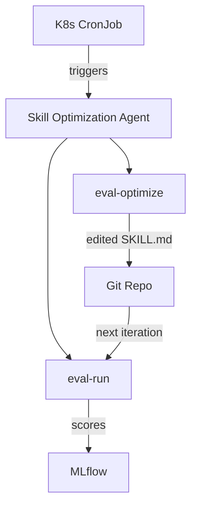

# Sprint 1 Assessment

## Sprint 1 Goals (from Implementation Doc)

Sprint 1 has three deliverables:

1. **Baseline benchmark**: Compare an openweight model (Qwen 27B) to Claude Opus 6 on the RFE Creator skill using the eval-harness
2. **Fine-tuned model benchmark**: Fine-tune the openweight model and compare to baseline + Claude
3. **Reference architecture for skill optimization**: Deploy a cron-based skill optimization agent with MLflow trace storage

---

## Deliverable 1: Baseline Benchmark

### Goal
Generate eval-harness report comparing Qwen 27B to Claude Opus 6 on the RFE Creator skill. Then optimize the skill (text only) for Qwen 27B and generate a second report.

### Approach Assessment

**Suggested approach from doc**:
- Deploy Qwen 27B in IBM cluster
- Run eval-harness locally using OpenCode pointing at Qwen 27B
- Use the same eval config from GitHub
- Only use openweight model for skill execution; Claude Opus 6 for judges

**Technical viability**:

| Step | Feasibility | Blocker? |
|------|-------------|----------|
| Deploy Qwen 27B | Done (already in IBM cluster) | No |
| Run eval-harness with OpenCode | Requires `runner.type: cli` configuration | **Partially blocked** |
| Same eval config | The RFE Creator eval config is in the agent-eval-harness repo | No |
| Claude for judges | Requires Anthropic API key for LLM judge calls | No |

### Key Technical Issue: Running with OpenCode

The eval-harness has no dedicated OpenCode runner. The path forward:

```yaml
runner:
  type: cli
  command: "opencode run {agent} --workspace {workspace} --model {model}"
```

**What works**: Execution, artifact collection, scoring.
**What doesn't work**: Structured events (`events.json` will be empty unless OpenCode outputs Claude-compatible JSONL), tool interception hooks, permission denial tracking.

**Impact**: Judges that depend on `outputs["events"]` or `outputs["conversation"]` will receive empty data. Judges that read file artifacts (`outputs["files"]`) will work fine.

**Recommendation**: For Sprint 1, focus on file-artifact-based judges (frontmatter validation, output quality via reference comparison). Skip event-dependent judges or add explicit handling for empty events.

### Open Questions Status

| Question | Status | Answer/Recommendation |
|----------|--------|----------------------|
| Which openweight model? | Answered: Qwen 27B (installed in IBM cluster) | Proceed |
| How to run eval-harness with OpenCode? | Partially answered: Use `cli` runner | Need to validate OpenCode CLI interface and write the command template |

---

## Deliverable 2: Fine-Tuned Model Benchmark

### Goal
Fine-tune Qwen 27B for the RFE Creator skill. Generate eval-harness reports comparing non-FT, FT, and Claude.

### Approach Assessment

**Data sources**:
- Production traces from Antonin (promised but status unclear)
- Autofixer results (available but format unclear)

**Training approach**: TBD (SFT, OSFT, DPO, GRPO)

### Recommended Training Strategy

For Sprint 1 (fast iteration, proving the pipeline):

1. **Start with SFT** on production traces
   - Simplest approach, well-understood
   - Requires: (input_prompt, successful_completion) pairs
   - Use LoRA SFT to avoid full model retraining cost
   - Training Hub supports this via built-in ClusterTrainingRuntime on RHOAI

2. **Then DPO** using eval-harness judge scores
   - Run the SFT model through eval-harness
   - Use pairwise comparison (SFT output vs Claude output on same inputs)
   - This produces clean preference pairs
   - Requires the judge-to-DPO bridge (does not exist yet)

3. **Defer GRPO** to Sprint 2
   - GRPO needs verifiable reward functions
   - Eval-harness judges can serve this role, but the integration needs more work
   - Higher complexity, should prove SFT+DPO pipeline first

### Open Questions Status

| Question | Status | Recommendation |
|----------|--------|---------------|
| FT objective? | Unanswered | Start with LoRA SFT, then DPO |
| Can judges be expressed as FT signal? | Unanswered | Yes, via the judge-to-DPO bridge described in [03-inner-loop-analysis.md](03-inner-loop-analysis.md) |
| Production traces availability? | Pending (Antonin) | Fallback: generate synthetic traces with Claude + RFE Creator, or use autofixer results |

---

## Deliverable 3: Reference Architecture for Skill Optimization

### Goal
A deployable, cron-based agent that:
- Has a configurable initial skill
- Runs on a schedule
- Stores traces and skill artifacts in MLflow
- Is deployed reproducibly (Helm chart)

### Approach Assessment

This is the **outer loop** deployed as a Kubernetes CronJob. Mapping to eval-harness components:



### What Already Exists
- eval-harness skills: `/eval-run`, `/eval-optimize` -- fully functional
- MLflow integration: `/eval-mlflow` -- logs results, traces, feedback
- EvalHub adapter: `deploy/evalhub/` -- runs in Kubernetes (but hardcodes ClaudeCodeRunner)

### What Needs Building
1. **CronJob wrapper**: Kubernetes CronJob/Helm chart that triggers eval-run → eval-optimize loop
2. **Git integration**: Commit optimized SKILL.md back to repo (or store in MLflow artifacts)
3. **Configurable skill target**: Parameterize which skill to optimize (via env var or ConfigMap)
4. **Runner flexibility**: The EvalHub adapter currently hardcodes `ClaudeCodeRunner` -- needs to honor `runner.type` from eval.yaml

### Open Questions Status

| Question | Status | Recommendation |
|----------|--------|---------------|
| Which skill to test? | RFE Creator ideal but needs JIRA write access | Use GitHub Issues Triage skill as alternative, or RFE Creator with JIRA emulator (eval-harness already supports this via `inputs.tools` blocking) |

---

## Overall Sprint 1 Assessment

| Deliverable | Readiness | Primary Risk |
|-------------|-----------|-------------|
| 1. Baseline benchmark | 70% ready | OpenCode CLI runner integration needs validation |
| 2. FT benchmark | 40% ready | Training data availability; judge-to-DPO bridge does not exist |
| 3. Ref arch (cron agent) | 50% ready | EvalHub adapter hardcodes ClaudeCodeRunner; Helm chart not started |

**Critical path**: Deliverable 1 unblocks Deliverable 2 (need baseline scores to measure FT improvement). Deliverable 3 can proceed in parallel.
